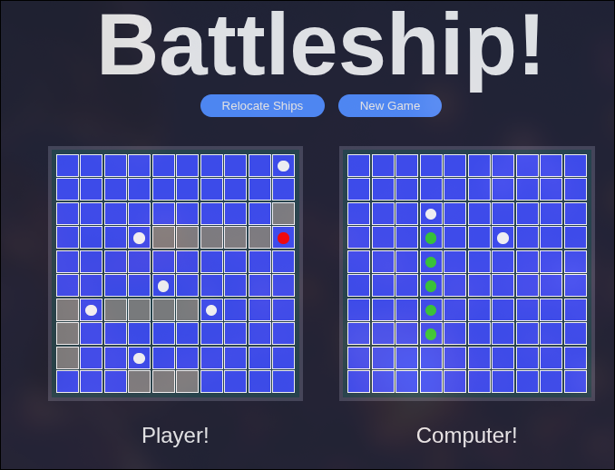

# Battleship

A classic naval strategy game built with **HTML, CSS, and JavaScript.**

---

## Live Demo

**[View the Live App Here!](https://deeppatel-dev.github.io/battleship/)**

---

## Features

- 🎯 **Interactive Gameplay** — Click to attack the enemy grid.
- 🚢 **Random Ship Placement** — Ships are automatically arranged randomly each game.
- 💥 **Hit and Miss Indicators** — Red dots for hits, white dots for misses.
- ✅ **Sunk Ship Highlight** — When an enemy ship is completely destroyed, its hit dots turn green.
- 🔄 **Relocate Ships** — Randomize your ships again before starting.
- 🧠 **Computer AI** — The computer takes turns attacking your board.

---

## Screenshot



---

## Tech Stack

- **HTML** — Structure
- **CSS** — Styling and animations
- **JavaScript** — Game logic and DOM updates

---

## Installation and Usage

Clone the project

```bash
  git clone https://github.com/deeppatel-dev/battleship
```

Go to the project directory

```bash
  cd battleship
```

Install dependencies

```bash
  npm install
```

Start the server

```bash
  npm run dev
```
